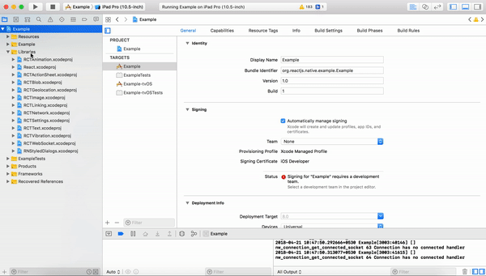
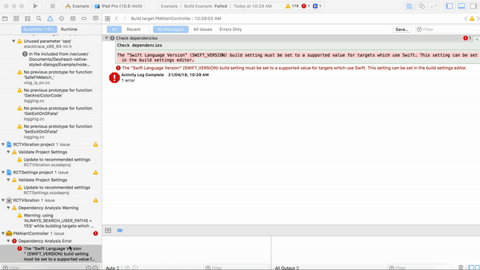

<p align="center">
  
</p>

<p align="center">
  
</p>


<p align="center">
  <a href="https://www.npmjs.com/package/react-native-styled-dialogs"></a>
  <a href="https://github.com/prscX/react-native-styled-dialogs/pulls"></a>
  <a href="https://github.com/prscX/react-native-styled-dialogs#License"></a>
</p>


# React Native: Native Styled Dialogs
React Native Library that shows a beautiful and customizable designed dialog with header. This library is a bridge around [Android: MaterialStyledDialogs](https://github.com/javiersantos/) & [iOS: PMAlertController](https://github.com/pmusolino/PMAlertController)


## Getting started

`$ npm install react-native-styled-dialogs --save`

`$ react-native link react-native-styled-dialogs`


- **Android**

> Library id supported SDK 25 > above

Please add below snippet into your app `build.gradle`

```javascript

allprojects {
    repositories {
        mavenLocal()
        jcenter()
        maven {
            url "https://jitpack.io"
        }
    }
}
```


- **iOS**

  - Run Command: cd ../node_modules/react-native-styled-dialogs/ios && pod install. If it has error => try pod repo update then pod install

  - Add [PMAlertController](https://github.com/pmusolino/PMAlertController) in your app Embedded Binaries & Linked Frameworks and Libraries. Please follow below video in order to achieve the same:

    

  - Now build your iOS app through Xcode

  - If you receive below error, please check video below in order to resolve the same:

    

    **SOLUTION**

    


## Usage

```javascript
import RNStyledDialogs from 'react-native-styled-dialogs';

RNStyledDialogs.Show({
  title: "Awesome!",
  description:
    "Glad to you like RNStyledDialogs! If you are up for it, we would like to appreciate you receiving us.",
  positiveText: "Go",
  neutralText: "Close",
  negativeText: "Later",
  onPositive: () => { },
  onNeutral: () => { },
  onNegative: () => { },
  onCancellable: () => { }
});

```


## Props

- **Props: Generic**

| Prop              | Type       | Default | Note                                                                                                       |
| ----------------- | ---------- | ------- | ---------------------------------------------------------------------------------------------------------- |
| `title`       | `string`     |         | Specify title on dialogs
| `description`       | `string`     |         | Specify description on dialog
| `positiveText`       | `string`     |         | Specify positive button text
| `neutralText`       | `string`     |         | Specify neutral button text
| `negativeText`       | `string`     |         | Specify positive negative button text
| `headerBackgroundColor`       | `string - HEX COLOR`     |   `#FFFFFF`      | Specify header background color
| `headerIcon`       | `string`     |         | Specify header icon
| `dialogAnimation`       | `bool`     |    `true`     | Specify dialog animation (enable/disable)
| `darkerOverlay`       | `bool`     |    `false`     | Specify dialog overlay (enable/disable)
| `cancelable`       | `bool`     |         | Specify cancelable of dialog behaviour (enable/disable)
| `autoDismiss`       | `bool`     |    `false`     | Specify dialog should get automatically dismiss or not (enable/disable)
| `onPositive`       | `func`     |         | Specify positive click callback function
| `onNeutral`       | `bool`     |         | Specify netural click callback function
| `onNegative`       | `bool`     |         | Specify negative click callback function
| `onCancellation`       | `bool`     |   `true`      | Specify cancellation callback function


- **Props: Android**

| Prop              | Type       | Default | Note                                                                                                       |
| ----------------- | ---------- | ------- | ---------------------------------------------------------------------------------------------------------- |
| `headerBackgroundImage`       | `string`     |         | Specify header background image
| `headerTitle`       | `string`     |         | Specify header title
| `headerIconAnimation`       | `bool`     |    `true`     | Specify header icon animation (enable/disable)
| `scrollable`       | `bool`     |    `false`     | Specify description scrollable (enable/disable)
| `maxLines`       | `number`     |    `5`     | Specify description max number of lines


- **Props: iOS**

| Prop              | Type       | Default | Note                                                                                                       |
| ----------------- | ---------- | ------- | ---------------------------------------------------------------------------------------------------------- |
| `positiveTextColor`      | `string - HEX COLOR`     |         | Specify positive button text color
| `positiveBackgroundColor`      | `string - HEX COLOR`     |    `#FFFFFF`     | Specify positive button background color
| `neutralTextColor`      | `string - HEX COLOR`     |         | Specify neutral button text color
| `neutralBackgroundColor`      | `string - HEX COLOR`     |     `#FFFFFF`    | Specify neutral button background color
| `negativeTextColor`      | `string - HEX COLOR`     |         | Specify negative button text color
| `negativeBackgroundColor`      | `string - HEX COLOR`     |     `#FFFFFF`    | Specify negative button background color


## Providing Images

> **Note:** Since we are using native libraries, we have not found a solution in order to render RN Images in production, therefore please copy all your image assets in platform specific folders:

- **Android:** Please copy your image assets in app resource drawable folder
- **iOS:** Please copy your image assets in app resources folder

> Please refer example application for the image usage.


## Credits

- Android: [Android: MaterialStyledDialogs](https://github.com/javiersantos/)
- iOS: [iOS: PMAlertController](https://github.com/pmusolino/PMAlertController)

## Contribution
Contributions are welcome and are greatly appreciated! Every little bit helps, and credit will always be given.


## License
This library is provided under the Apache 2 License.

RNStyledDialogs @ Pranav Raj Singh Chauhan

